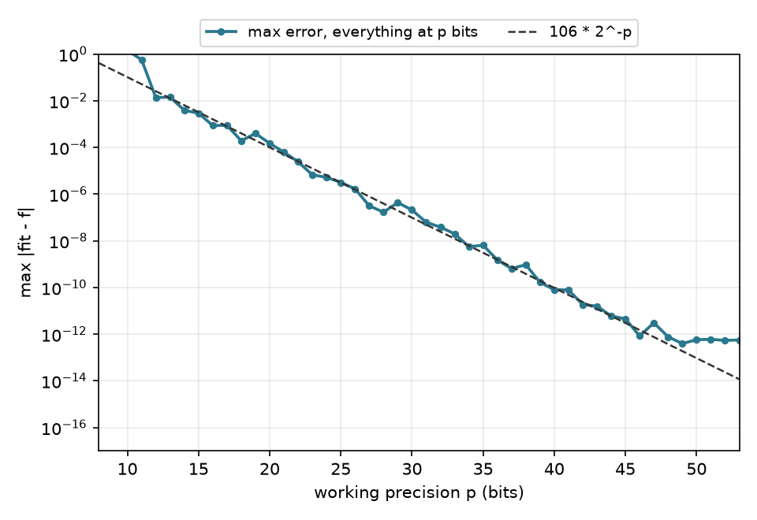

# pbit

[](https://github.com/samlayton99/pbit/actions/workflows/tests.yml)

**p-bit floating point for Python: a correctly rounded array type for any significand width from 2 to 53 bits, and reference LAPACK least squares ported to it.**

Pick a precision $p$. pbit then does three things:
- Every $+$, $-$, $\times$, $\div$ and $\sqrt{\ }$ is rounded exactly as an IEEE 754 machine with a $p$-bit significand would round it: to nearest, ties to even, with subnormals and overflow.
- Least squares runs reference LAPACK's `DGELSS` with every operation inside the solver at $p$ bits.
- Nothing is computed in higher precision behind your back. Operations pbit doesn't implement raise an error instead of silently falling back to binary64.

It's built for questions of the form "what does this computation do with $p$ bits of precision?": how error scales with $p$ (bit-complexity arguments), low-precision numerics, and emulating fp16, bf16, tf32 or fp8 on a CPU.

```python
import numpy as np
import pbit

A = np.random.default_rng(0).standard_normal((100, 5))
b = A @ np.arange(1.0, 6.0)

x, residuals, rank, s = pbit.lstsq(A, b, fmt=pbit.BF16)   # the whole solve in bfloat16 arithmetic
x, residuals, rank, s = pbit.lstsq(A, b, fmt=19)          # ... or with a 19-bit significand
x.to_numpy()                                             # exact binary64 copy of the p-bit result
```

In binary32 and binary64, `pbit.lstsq` is bit-identical to netlib reference LAPACK `SGELSS`/`DGELSS`. The other formats run the same code with every operation rounded to $p$ bits.

## Why

Most "low precision" experiments round the inputs and outputs but run the core of the computation, the solver above all, in binary64. The result then says little about $p$-bit arithmetic. pbit makes the arithmetic model explicit and applies it everywhere, including inside a real, standard solver. For example, fitting a function by least squares with every step at $p$ bits gives an error that falls by one bit per bit of precision:

<p align="center"></p>

(`examples/precision_sweep.py`: 40 Chebyshev features built by recurrence at $p$ bits, solved with `pbit.lstsq`, evaluated at $p$ bits; the error is measured in binary64.)

## Install

```bash
pip install git+https://github.com/samlayton99/pbit
```

Requires Python 3.10+, numpy and mpmath, and a C compiler (`cc`, or `$CC`). The C kernels compile on first use, in a few seconds, into `~/.cache/pbit` (or `$PBIT_CACHE_DIR`). Tested on macOS (arm64, clang) and Linux (x86-64, gcc), Python 3.10 and 3.12; the reference-LAPACK and audit checks run in CI on both.

## Formats

```python
pbit.Format(19)            # 19-bit significand, exponent range [-958, 959] (binary64's, minus 64 binades each end)
pbit.Format(11, emax=15)   # IEEE-style range, emin = 1 - emax  ->  same as pbit.FP16
pbit.FP64, pbit.FP32, pbit.FP16, pbit.BF16, pbit.TF32, pbit.FP8_E5M2
```

`fmt.eps` is $2^{1-p}$ and `fmt.unit_roundoff` is $2^{-p}$; `fmt.max`, `fmt.min_normal` and `fmt.min_subnormal` give the range.

## The array type

```python
x = pbit.array([0.1, 0.2, 0.3], fmt=12)     # values rounded into the format once
y = x * 3 + 1                                # every operation correctly rounded at 12 bits
pbit.sqrt(x), pbit.tanh(x)                   # sqrt correctly rounded; tanh from +,-,*,/ (<= 3 ulp)
x.sum(), x @ x, A @ x                        # fixed orders: left to right; reference BLAS for products
np.add(x, 1), np.sum(x)                      # numpy calls pbit implements run in the format
np.exp(x)                                    # TypeError: not implemented at p-bit precision
with pbit.precision(pbit.BF16):              # a default format for a block of code
    z = pbit.array(data)
```

A `PArray` holds values of one format. Plain numbers and numpy arrays used with it are rounded into the format first, the way a $p$-bit machine loads them. Mixing two formats raises; convert explicitly with `.astype(fmt)`.

| from | into pbit | out of pbit |
|---|---|---|
| numpy (float16/32/64, ints, bool, longdouble) | `pbit.array(a, fmt)` | `x.to_numpy()` (binary64, exact); `x.to_numpy(np.float32)` (only if exact); `np.asarray(x)` |
| Python numbers and lists | `pbit.array(1/3, fmt)` | `float(x)`, `x.tolist()` |
| exact numbers: `int`, `Fraction`, `Decimal`, mpmath `mpf`, gmpy2 `mpfr` | rounded once from the exact value (no detour through binary64) | `x.to_fractions()` |
| torch tensors (any float dtype, any device) | `pbit.array(t, fmt)` | `x.to_torch()` (float64); `x.to_torch(torch.bfloat16)` (only if exact) |
| another format | `x.astype(fmt)` | |

## Least squares

`pbit.lstsq(a, b, rcond=None, *, fmt=None)` has numpy's signature and returns `(x, residuals, rank, s)`. It is reference LAPACK 3.12.1 `DGELSS`, the SVD-based minimum-norm solver, ported operation by operation, with the machine parameters of the format. The port covers every `DGELSS` path:
- over- and underdetermined systems, with and without the QR/LQ step;
- several right-hand sides;
- rescaling of badly scaled data;
- rank deficiency.

The default `rcond` is machine precision $2^{1-p}$ (LAPACK's convention). numpy's `eps * max(M, N)` can exceed 1 in a narrow format. `pbit.lstsq_cutoffs(a, b, rconds)` evaluates several cutoffs from one decomposition.

## Guarantees, and how they are checked

- **Arithmetic.** Each $+,-,\times,\div,\sqrt{\ }$ equals MPFR's correctly rounded result:
  - for every $p$ from 2 to 53 and every preset;
  - including midpoint ties, subnormals, overflow and results near $2^{-1000}$.

  FP32, FP64 and FP16 also equal numpy's hardware arithmetic.
- **Solver.** `lstsq` is bit-identical to netlib reference `SGELSS`/`DGELSS`, built from the vendored Fortran with gfortran and no fused multiply-add. The check covers every path, random, rank-deficient and graded matrices, extreme scales, and several cutoffs.
- **No hidden precision.** A static audit (`python -m pbit.audit`) parses the C with clang, with all macros expanded and all branches included. It finds no floating-point operation outside the rounding layer, with one documented integer-valued exception from LAPACK. Negative controls show it catches planted leaks.
- **Threads.** Results are bit-identical for any thread count.

The details are in [docs/DESIGN.md](docs/DESIGN.md): how the emulator gets the exact rounding, the tanh algorithm, the port, and the verification.

## Performance

`pbit.lstsq` on dense Gaussian matrices (Apple M-series, 10 threads; `python benchmarks/bench.py`):

| problem | format | 1 thread | 10 threads | numpy float64 lstsq |
|---|---|---:|---:|---:|
| 1000 x 200 | p = 24 (emulated) | 0.29 s | 0.13 s | 0.005 s |
| 1000 x 200 | p = 40 (emulated) | 0.31 s | 0.14 s | 0.005 s |
| 1000 x 200 | fp32 (native path) | 0.03 s | 0.03 s | 0.005 s |
| 1000 x 200 | fp64 (native path) | 0.03 s | 0.03 s | 0.005 s |
| 2401 x 513 | p = 24 (emulated) | 4.52 s | 1.10 s | 0.028 s |
| 2401 x 513 | p = 40 (emulated) | 4.72 s | 1.13 s | 0.028 s |
| 2401 x 513 | fp32 (native path) | 0.39 s | 0.24 s | 0.028 s |
| 2401 x 513 | fp64 (native path) | 0.41 s | 0.26 s | 0.028 s |
| 4801 x 1025 | p = 24 (emulated) | 34.76 s | 6.74 s | 0.155 s |
| 4801 x 1025 | p = 40 (emulated) | 36.39 s | 7.74 s | 0.155 s |
| 4801 x 1025 | fp32 (native path) | 3.25 s | 1.20 s | 0.155 s |
| 4801 x 1025 | fp64 (native path) | 3.32 s | 1.22 s | 0.155 s |

Exactly FP32 and FP64 run on native hardware through the same port. This path is bit-identical to the emulator. Other formats cost about 10–15 times as much per operation as native arithmetic. Loops over independent columns and rows run on all cores; set the count with `pbit.set_num_threads(n)` or `PBIT_NUM_THREADS`. The results don't depend on it.

## Limits

- **Round to nearest, ties to even, only.** Other rounding modes and IEEE exception flags aren't emulated; `pbit.events()` counts overflows, underflows and non-finite results.
- **Exponent ranges.** Ranges are IEEE-style ($e_{\min} = 1 - e_{\max}$). $e_{\max} \le 1023$, and $e_{\min} \ge -1022 + p + 1$ except for exactly binary64. The non-IEEE OCP FP8 E4M3 isn't provided.
- **Narrow formats.** In a format whose exponent range is narrow relative to $p$ (FP16, FP8), LAPACK's safe-scaling branches are taken often and cost accuracy. That is how LAPACK's algorithm behaves in such a format. `Format(p)` isolates the effect of significand width.
- **Bit-identical to reference LAPACK only.** The match is with reference LAPACK in its unblocked configuration, not with optimized libraries (OpenBLAS, MKL, Accelerate), which reorder operations.
- **Elementary functions.** Only sqrt and tanh; others raise.
- **Platforms.** macOS and Linux with a C compiler; Windows is untested.

## Development

```bash
python -m venv .venv && . .venv/bin/activate
pip install -e ".[test]"
pytest                 # needs gmpy2; the reference-LAPACK tests also need gfortran, the audit needs clang
python -m pbit.audit   # prints the audit findings (only the documented exception)
```

## License

BSD 3-Clause. `src/pbit/csrc/lapack_gelss.h` is derived from Reference LAPACK, and `third_party/lapack-3.12.1` vendors the netlib Fortran used for verification. Both are under LAPACK's modified BSD license, in `third_party/lapack-3.12.1/LICENSE`.
